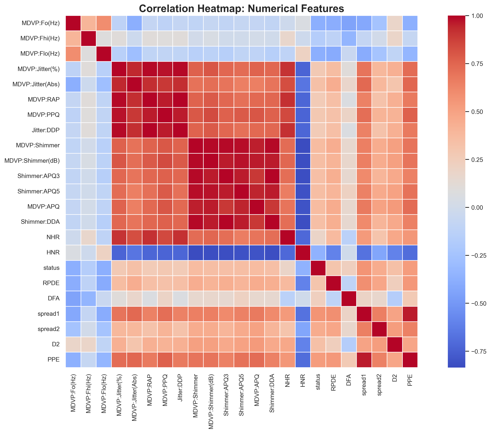
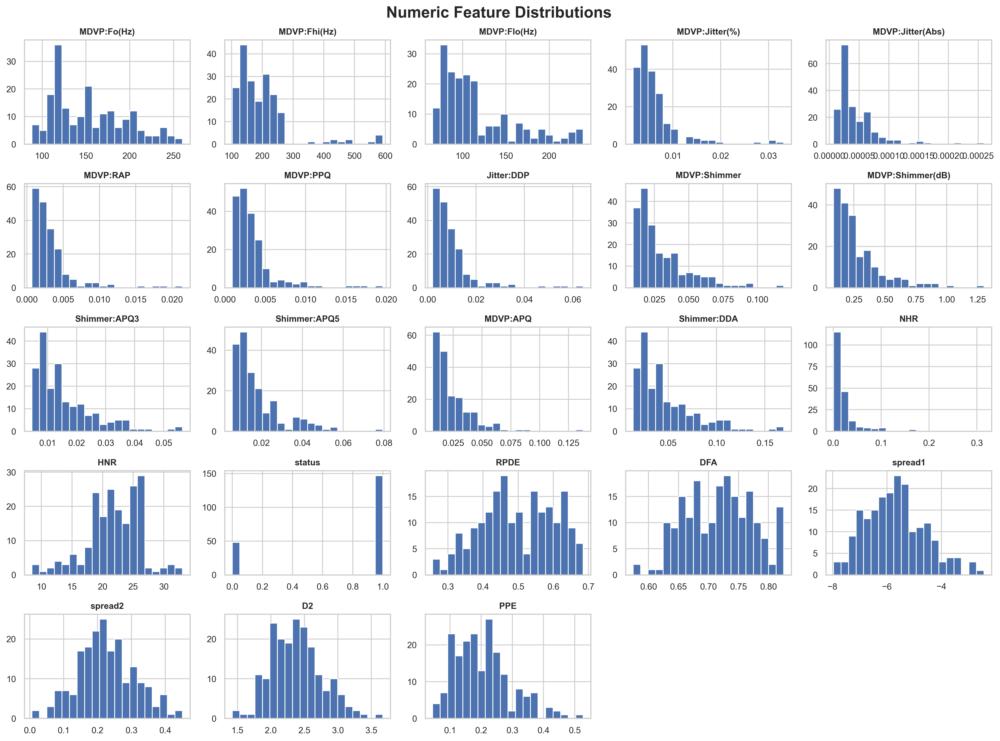
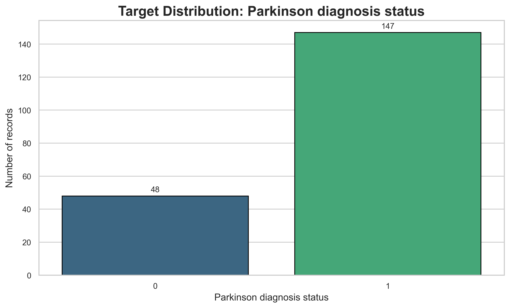

# 🧠 Python EDA Toolkit

> AI-assisted exploratory data analysis, scalable visual diagnostics and intelligent baseline Machine Learning workflows for structured datasets.

Python EDA Toolkit is a modular and production-oriented Python framework designed to accelerate real-world Data Science workflows through automated analysis, adaptive preprocessing intelligence and scalable ML-ready reporting.

Built to bridge the gap between:

* raw datasets
* exploratory analysis
* preprocessing decisions
* Machine Learning experimentation
* actionable analytical insights

The toolkit combines:

* automated EDA
* memory-aware processing
* adaptive visualizations
* ML-readiness diagnostics
* explainable model recommendations
* lightweight benchmarking workflows
* reusable HTML reporting

From raw CSV to actionable insights in minutes.

---

# 🚀 Why Python EDA Toolkit?

Most exploratory workflows still require:

* repetitive boilerplate code
* manual preprocessing inspection
* disconnected visualizations
* scattered recommendations
* notebook-heavy experimentation
* non-reusable workflows

Python EDA Toolkit transforms that process into a reusable and scalable analytical workflow assistant capable of automatically generating:

✅ dataset profiling
✅ preprocessing intelligence
✅ visual diagnostics
✅ ML-readiness scoring
✅ baseline model recommendations
✅ lightweight benchmarking workflows
✅ production-style HTML reports

The goal is simple:

> Reduce friction between raw structured data and reliable ML experimentation.

---

# ⚡ Core Design Principles

Python EDA Toolkit was designed around practical Data Science engineering principles:

* modular architecture
* reusable workflows
* scalable preprocessing
* memory-aware execution
* explainable recommendations
* lightweight automation
* adaptive visualization pipelines
* production-oriented reporting

The framework prioritizes:

* fast experimentation
* educational clarity
* real-world usability
* scalable analysis workflows
* maintainable Python package design

---

# 👩‍💻 Built For

* Data Analysts
* Data Scientists
* Machine Learning practitioners
* Python developers
* educational environments
* rapid prototyping workflows
* portfolio-ready ML projects
* reusable analytical pipelines

Compatible with:

* Jupyter Notebook
* Google Colab
* Kaggle
* local Python environments
* reusable ML pipelines

---

# ✨ Key Features

---

## 📊 Smart Automated EDA

Automatically performs:

* dataset inspection
* duplicate detection
* missing value analysis
* skewness analysis
* outlier detection
* target analysis
* ML problem detection
* high-cardinality detection
* identifier column detection
* preprocessing recommendations
* model recommendations

The toolkit adapts automatically to:

* regression problems
* classification problems
* small datasets
* large datasets
* mixed feature structures

---

## ⚡ Memory-Aware Large Dataset Processing

Designed to handle medium and large datasets efficiently through adaptive analysis strategies.

Includes:

* adaptive row sampling
* lightweight plotting
* sparse-safe encoding
* automatic plot skipping for large datasets
* controlled model complexity
* optimized preprocessing pipelines

Example:

```text
Skipping row-level missing values heatmap (dataset has 114000 rows)
```

The objective is to keep exploratory workflows:

* responsive
* lightweight
* scalable
* reproducible

without overwhelming memory or execution time.

---

## 🤖 Automated Baseline ML Benchmarking

Supports:

* regression workflows
* classification workflows

Automatically benchmarks:

* Dummy baselines
* Linear models
* Tree-based models
* Gradient boosting models

Includes:

* explainable recommendations
* scalable defaults
* safe preprocessing
* lightweight benchmarking mode
* adaptive model selection

Example supported models:

* Ridge Regression
* RandomForestRegressor
* HistGradientBoostingRegressor
* Logistic Regression
* RandomForestClassifier
* Gradient Boosting

---

## 📈 Adaptive Visual Diagnostics

Automatically generates:

* target distributions
* correlation heatmaps
* numeric distributions
* categorical distributions
* missing value diagnostics
* outlier overviews
* feature-target relationships

Plots automatically adapt to:

* dataset size
* feature types
* memory constraints
* task type
* high-cardinality scenarios

This allows the toolkit to remain usable across:

* educational notebooks
* portfolio projects
* exploratory business workflows
* medium-scale datasets

---

## 📝 Professional HTML Reports

Generate reusable HTML reports including:

* executive summaries
* dataset readiness scoring
* preprocessing recommendations
* model recommendations
* visual diagnostics
* workflow suggestions
* ML-readiness indicators

Designed with:

* dark modern UI
* reusable sections
* portfolio-friendly visuals
* scalable report structure
* lightweight rendering

The generated reports are intended to provide:

* quick analytical understanding
* actionable preprocessing guidance
* explainable ML recommendations
* shareable workflow summaries

---

# 🚀 Installation

## Install directly from GitHub

```bash
pip install git+https://github.com/beatriangu/Python-EDA-Toolkit.git
```

---

# ⚡ Quick Start

## One-Line Smart Dataset Analysis

```python
from python_eda_toolkit import auto_analyze


df = auto_analyze(
    "dataset.csv",
    target="target",
    plots=True,
    save_plots=True,
    export_html=True,
)
```

---

# 📊 Example Output

```text
Detected Task Type
============================================================
regression

Recommended Models
============================================================
- Ridge Regression
- RandomForestRegressor
- HistGradientBoostingRegressor

Execution Summary
============================================================
Analysis time  : 3.97s
Modeling time  : 6.90s
Total time     : 11.13s
```

---

# 🧠 Data Readiness Score

The toolkit automatically evaluates dataset readiness for Machine Learning workflows.

Example:

| Category          | Score |
| ----------------- | ----- |
| Completeness      | 16/20 |
| Dataset Size      | 20/20 |
| Feature Structure | 14/20 |
| Quality Signals   | 14/20 |
| Model Readiness   | 13/20 |

Final readiness:

```text
77/100 → ML-ready with review
```

The score helps identify:

* preprocessing effort
* structural risks
* scalability concerns
* feature engineering complexity
* workflow readiness

Important:

> The readiness score is not model accuracy.
> It is a structural indicator for EDA and ML preparation.

---

# 📸 Example Visualizations

## Correlation Heatmap



---

## Numeric Feature Distributions



---

## Target Distribution



---

# 🤖 Model Benchmarking

```python
from python_eda_toolkit.models import compare_models


results = compare_models(
    df,
    target="target",
    mode="fast",
)

print(results)
```

Example output:

```text
 rank  model                         r2_score
    1  RandomForestRegressor           0.1977
    2  HistGradientBoostingRegressor   0.1512
    3  Ridge                            0.0253
```

---

# 📂 Project Structure

```text
Python-EDA-Toolkit/
│
├── python_eda_toolkit/
│   ├── eda/
│   ├── models/
│   ├── preprocessing/
│   ├── reporting/
│   ├── smart/
│   ├── visualization/
│   └── utils/
│
├── reports/
├── assets/
├── notebooks/
├── tests/
│
├── demo.py
├── requirements.txt
├── setup.py
└── README.md
```

---

# 🧪 Technologies

Built with:

* Python
* Pandas
* NumPy
* Scikit-learn
* Matplotlib
* Seaborn
* SciPy
* Jupyter Notebook

---

# 🎯 Engineering Goals

This project focuses on:

* reusable Data Science architecture
* explainable automated EDA
* scalable visualization pipelines
* memory-aware ML workflows
* practical ML experimentation
* modular Python package design
* production-style reporting
* intelligent preprocessing guidance

---

# 🗺️ Roadmap

Planned improvements include:

* CLI support
* Streamlit dashboard
* Plotly interactive reports
* feature importance analysis
* time series workflows
* AutoML starter pipelines
* exportable preprocessing pipelines
* model persistence utilities
* advanced encoding strategies
* configurable report themes

---

# ✅ Current Status

Implemented:

* Smart automated EDA
* Adaptive plotting engine
* Data Readiness Scoring
* HTML reporting
* Baseline ML benchmarking
* Large dataset support
* Google Colab compatibility
* Modular architecture
* Automated recommendations
* Memory-aware workflows

---

# 👩‍💻 Author

## Bea Lamiquiz

Python • Data Science • Machine Learning • AI • Django

Passionate about building practical, scalable and reusable analytical workflows combining:

* Python engineering
* Data Analysis
* Machine Learning
* Artificial Intelligence
* workflow automation
* production-oriented tooling

Focused on transforming exploratory analysis into faster, smarter and more actionable workflows.

---

# 🧠 Vision

Python EDA Toolkit is evolving toward a smarter analytical assistant capable of helping developers and analysts move faster from raw structured data to reliable Machine Learning experimentation.

The long-term vision is to build:

* scalable EDA workflows
* intelligent preprocessing assistants
* explainable ML diagnostics
* reusable analytical tooling
* lightweight AutoML-inspired workflows

without sacrificing:

* clarity
* modularity
* engineering quality
* interpretability

---

# ⭐ Support

If you find this project useful:

* ⭐ Star the repository
* 🍴 Fork it
* 🚀 Use it in your workflows
* 📊 Share feedback and improvements
* 🤝 Contribute to the project

---

# 🚀 From Raw Data to Actionable Insights

Python EDA Toolkit helps transform exploratory analysis into:

* faster workflows
* smarter preprocessing
* clearer diagnostics
* reusable experimentation
* production-oriented analytical reporting

Designed to make structured data workflows:

* smarter
* cleaner
* faster
* more scalable
* more explainable


